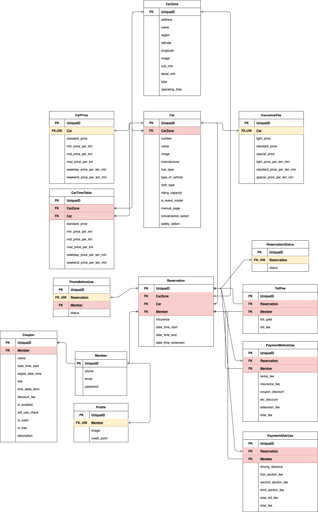

# Readme

## SOFASTCAR - Backend API

---

카셰어링 서비스 [SOCAR](https://www.socar.kr/) 의 백엔드 클론 프로젝트 입니다.

## Architecture

---

### Server

- Amazon EC2 - ubuntu 18.04.5 LTS

### Language

- python  3.7.5

### Framework

- Django-RestFramework 3.11

### Deploy

- production : gunicorn
- docker 사용, python 코드 배포 자동화

### Database

- AWS RDS PostgresSQL 12.3-R1

### Storage(StaticFiles)

- Amazon S3

## Tools

---

- Slack
- Google Meet, Hang out
- Drow.io
- Pycharm
- Trello
- Sentry

## 1차 스프린트 (2020.09.03 ~ 2020.09.18)

## 2차 스프린트 (2020.09.19 ~ 2020.10.08)
- 팀 구성원의 변경
- 1차 스프린트 미완성분에 대한 보완, 모델 재설계 작업
- 

### MVP development

  
  
  
  

### 결과(영상)
- [로그인, 회원가입](https://youtu.be/W0kjmeD3b3g)
- [메인, 예약](https://youtu.be/RbDSDtoGo4E)
- [사용, 반납](https://youtu.be/wYxdN_Lp_Cs)
- [ARDUINO-리모콘 작동](https://youtu.be/7x6H_rOHzQA)
- [Sidebar](https://youtu.be/IRi1NMKAUaA)

## 회고
### 팀 이슈
- 첫 미팅 이후 코로나19로 인해 자택에서 프로젝트 진행하였다.
- 로그인 부분은 JWT를 사용하였고, 사용자의 휴대폰 번호로 인증번호를 확인하여 회원가입을 진행하였다.
- Socar 서비스는 지도상에 쏘카존에 맞는 위도, 경도 데이터가 필요했다.
- 처음엔 공공데이터 포탈에서 api를 신청하여 위도, 경도 데이터를 수집했으나, 업데이트가 되지 않은 오래된 데이터였다.
- 광범위한 지역을 테스트 하기엔 시간이 부족하여 회의를 통해 일단 서울 성수동 부근의 데이터만 수집하기로 하였다.
- 실제 App의 쏘카존 정보를 기반으로 google map에 검색하여 좌표를 획득하였다. 
- 처음 구성한 모델이 있었는데, 개발이 진행될수록 모델을 세부적으로 나누어 다시 구성하였다.
- 요청한 API 기능 완료될 때마다 ios 팀에게 전파(빠른 테스트와 피드백을 위해)
- 슬랙을 통한 실시간 피드백 대응하였다
- API 기능 자체를 개발할 때는 test case만 통과하면, 기본적인 기능이 작동 하는것으로 판단하고 ios팀에게 기능을 정리하여 전파하였다.(API docs update)
- 개발하다 보니 ios 팀에서 원하는 API의response 모습이 따로 있었다(기능 A, B, C가 한번의 쿼리에 다 나오게 해달라 등등)

### 코드 이슈
- letsencrypt를 이용하여 무료로 https를 사용했으나, 3개월 후 갱신이 되지 않는 이슈가 있다.(certbot-auto is deprecated on this system)
- test case 자체가 잘못되거나 부족한 경우, 의도하지 않은 결과가 나왔다.
- 처음엔 API 문서파일을 postman에 작성하였으나, api 25개 갯수 제한이 있어 drf-yasg 라이브러리를 이용하여 문서를 작성했다.
- 각자 맡은 부분 코딩을 하다 보면, 모델이 변경되는 부분이 생기고, 팀원마다 migration  파일이 달라지게 되고, merge 과정에서 충돌이 발생했다.
- 만일의 경우에 대비해 DB 파일을 백업해야겠다는 생각을 했고, django-import-export 를 사용하여 admin page에서 .csv 파일로 백업, 복구 가능하게 구성했다. 
- 완성되고 코드를 나중에 다시 보니, 내가 작성한 코드도 내가 알아보기 힘들었다.
- 클린한 코드, 남들이 봐도 이해하기 좋은 코드, OOP에 대한 개념이 부족하다는 점을 깨달았다.
- Django는거대한 성처럼 커다란 틀이 있어서, 왠만한 기능들이 이미 만들어져 있었다. 나는 공식 문서를 보고 필요한 기능을 찾아 쓰기만 하면 되었다.
- 다른 언어, 프레임워크로 백엔드를 어떻게 개발하는지 궁금하고, 어떤 이유로 그 프레임워크를 선택했는지 비교해보고 싶었다(Express.js, spring 등)
- 결론: 부족한 부분을 더 공부하자. 

